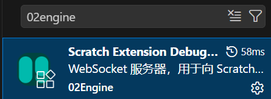
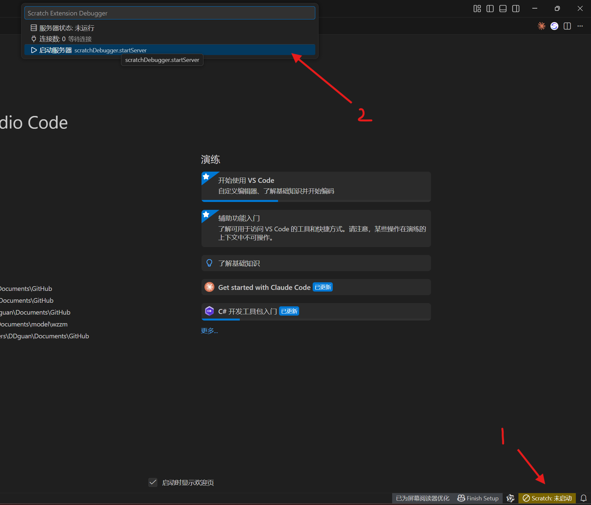
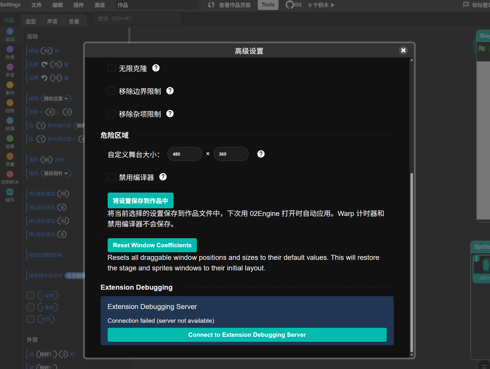
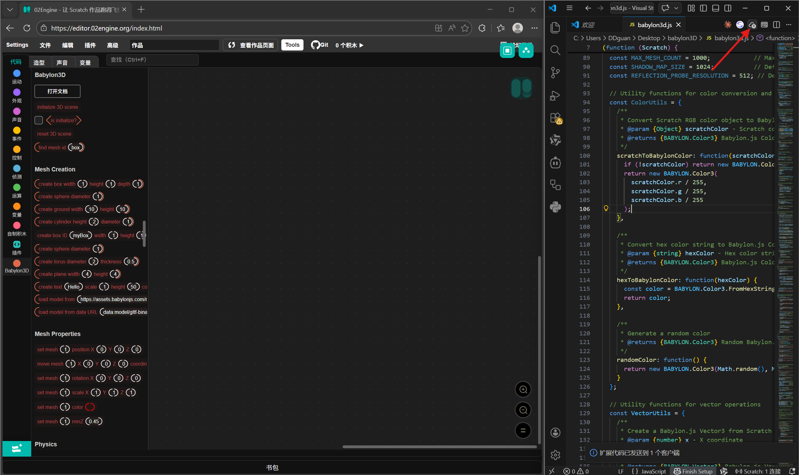

# Extension Debugger

02Engine includes a WebSocket bridge for the 02Engine VSCode Toolbox. It lets a local development tool push extension code into the running editor, reload it, and synchronize comment data used by related addons.

## How It Works

The GUI loads `ScratchExtensionDebug` in the browser. The service connects to:

```text
ws://localhost:1101
```

When connected, the local toolbox can send extension source code to the editor. 02Engine loads that code as a custom extension, refreshes the extension category, and updates the toolbox/workspace.

The bridge can also dispatch editor events such as `extensionDebugStatus` and `commentSyncUpdate`, which addons can listen to.

## Connect

1. Start the 02Engine VSCode Toolbox server.
2. Open 02Engine.
3. Open **Advanced Settings**.
4. Find **02Engine VScode Toolbox**.
5. Click **Connect to 02Engine VScode Toolbox Server**.
6. Confirm that the status changes to connected.

The editor also attempts to initialize the debug service automatically when the VM is available, but the manual button is useful if the toolbox starts after the editor.

## Reload Behavior

When the toolbox sends extension code:

- The code is converted into a `data:application/javascript` URL.
- 02Engine loads it through `vm.extensionManager.loadExtensionURL`.
- The debug service detects the extension ID.
- If the extension was already loaded, it removes the old extension registration and block definitions.
- The new version is loaded and the toolbox/workspace are refreshed.

This is intended for development. It is more aggressive than normal extension loading because reload speed matters while editing extension code.

## Screenshots

The original debugging flow is shown below:









## Troubleshooting

- If the status says the server is unavailable, make sure the toolbox server is running on port `1101`.
- If a browser blocks the connection, check local network/WebSocket permissions.
- If blocks do not refresh after reload, switch to another extension category and back, or reopen the extension library.
- If an old extension stays loaded, refresh the editor. Development reload intentionally touches VM internals and can leave stale state after syntax errors.

## Security

The debugger is a local development feature. Do not expose the WebSocket server to untrusted networks. Extension code sent through the debugger runs with the same trust level as custom extensions in the current 02Engine build.
