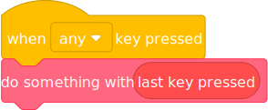

# 02Engine Extra Blocks

02Engine includes the extra block category inherited from TurboWarp. These blocks expose runtime features that Scratch projects normally cannot access.

For a larger set of extra blocks, use the 02Engine extension library and install trusted custom extensions.

## is compiled? and is 02Engine? {#is-compiled}

See https://scratch.mit.edu/projects/414716080/

These blocks are "compatible" with Scratch because they're actually just modified argument reporters.

:::warning
Every block beyond this warning is **incompatible** with Scratch. Projects that use them **cannot** be uploaded to the Scratch website. If you do not use any 02Engine-exclusive blocks, then Scratch compatibility depends on the other extensions and settings used by your project.
:::

## last key pressed {#last-key-pressed}

It tells you the last key that was pressed. It's intended to be used something like this:

## mouse button down? {#mouse-button-down}

It's like "mouse down?" but lets you check each individual button. Keep in mind that due to how Scratch interprets mouse input, it's possible for a block like "is primary mouse button down?" to report true while the standard "mouse down?" reports false.

 * (0) primary is usually left click
 * (1) middle is usually scroll wheel
 * (2) secondary is usually right click (running this block once will disable right click on the stage)
